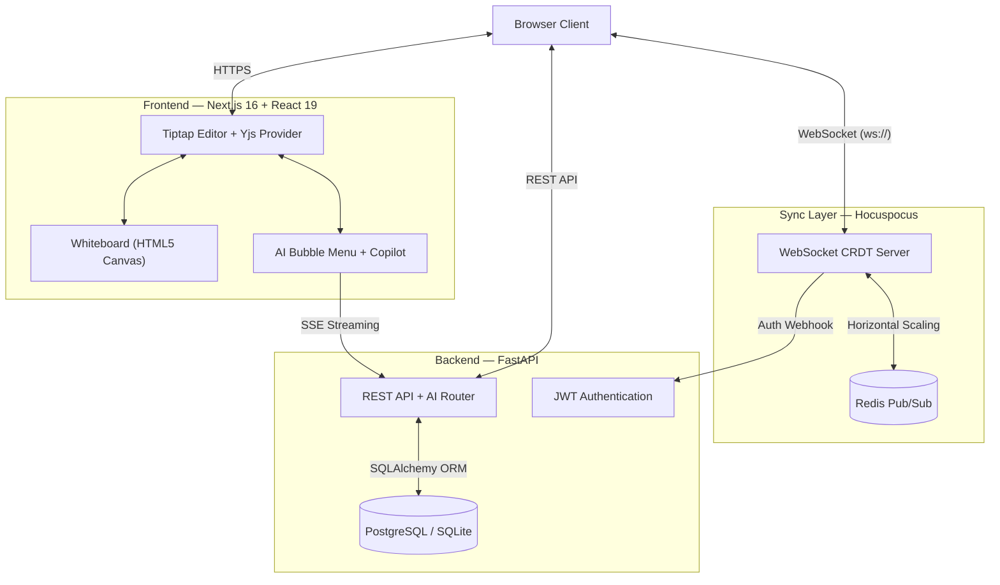
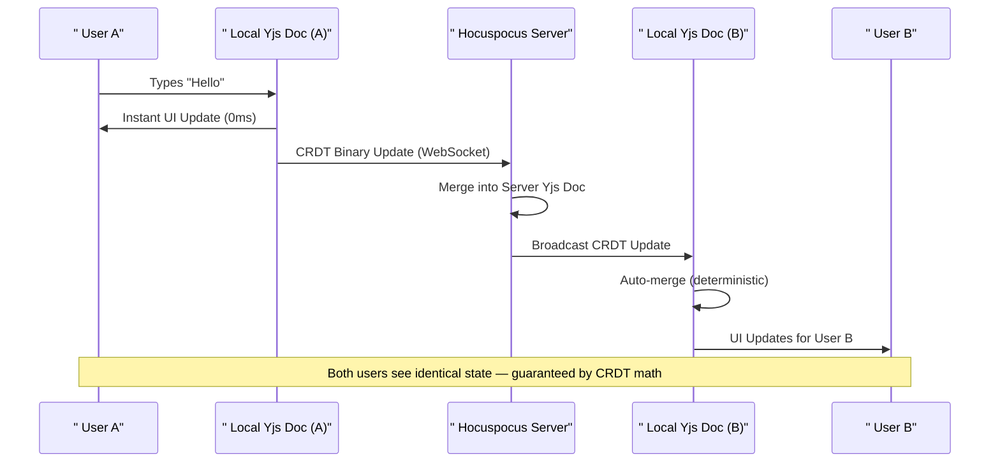
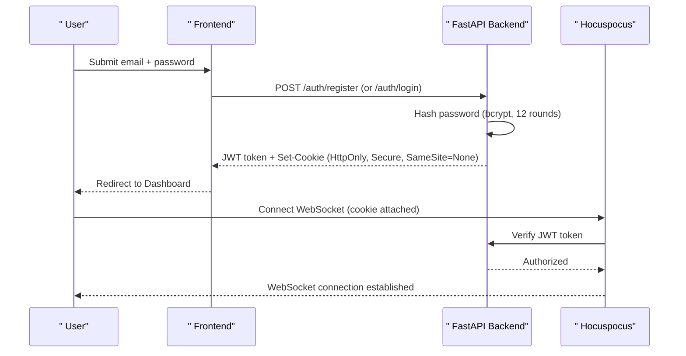
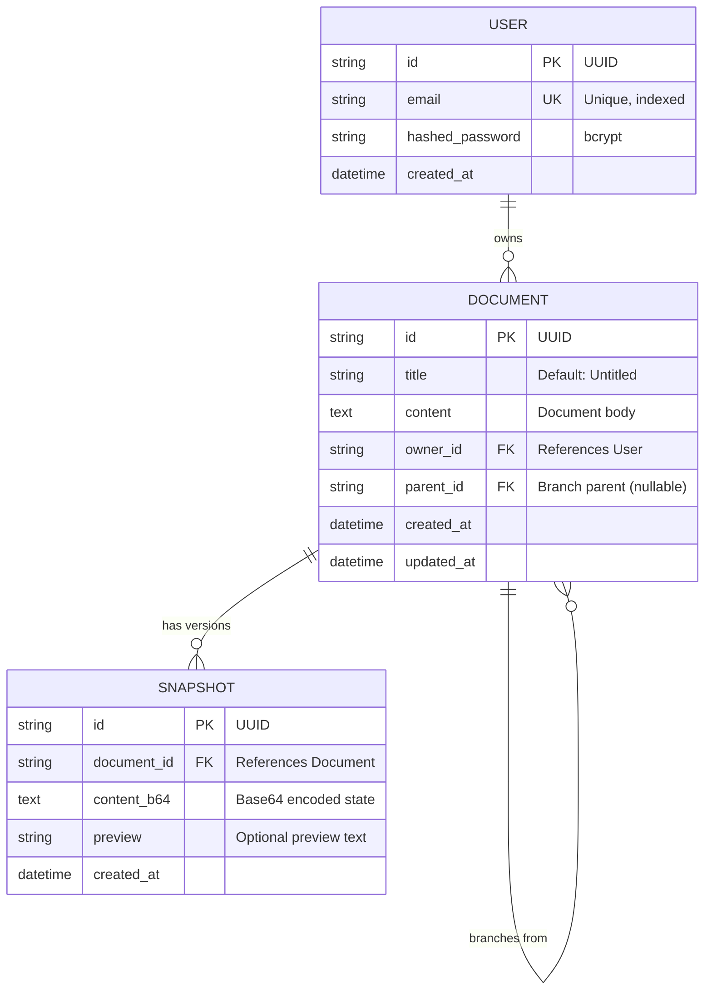

<div align="center">

# SyncPad

### Distributed Real-Time Collaborative Document Editor

**A production-grade, CRDT-powered collaborative workspace with AI co-authoring, interactive whiteboard, code sandboxes, and multiplayer presence — built with Next.js 16, FastAPI, and Yjs.**

[](https://syncpad-plus.netlify.app)
[](https://nextjs.org/)
[](https://fastapi.tiangolo.com/)
[](https://yjs.dev/)
[](https://react.dev/)
[](https://typescriptlang.org/)
[](https://postgresql.org/)
[](https://redis.io/)
[](https://docker.com/)
[](LICENSE)

</div>

---

##  Table of Contents

- [Overview](#-overview)
- [Live Demo](#-live-demo)
- [Features](#-features)
- [System Architecture](#-system-architecture)
- [Tech Stack](#-tech-stack)
- [Real-Time Collaboration Flow](#-real-time-collaboration-flow)
- [Authentication Flow](#-authentication-flow)
- [Data Model](#-data-model)
- [AI Features & Benchmarks](#-ai-features--benchmarks)
- [Project Structure](#-project-structure)
- [Quick Start](#-quick-start)
- [Deployment](#-deployment)
- [Environment Variables](#-environment-variables)
- [Contributing](#-contributing)
- [License](#-license)

---

##  Overview

SyncPad is a full-stack, real-time collaborative document editing platform that enables multiple users to simultaneously create, edit, and share rich-text documents with zero-latency conflict resolution. Built on **Conflict-Free Replicated Data Types (CRDTs)** via Yjs, every keystroke is an atomic, Lamport-clocked operation that auto-merges across any network partition — ensuring 100% consistency without operational locking.

### Why SyncPad?

| Problem | SyncPad's Solution |
|---|---|
| Traditional editors use OT (Operational Transform) which requires a central server | Uses **CRDTs** — edits merge deterministically with no central authority needed |
| Concurrent edits cause conflicts and data loss | **Yjs** guarantees mathematical convergence — zero data loss, zero conflicts |
| AI features feel bolted-on and disconnected | **Native AI co-authoring** with SSE streaming directly into the editor |
| Whiteboards require separate apps | **Embedded collaborative whiteboard** with drawing tools right inside documents |

---

##  Live Demo

| Service | URL | Platform |
|---|---|---|
| **Frontend** | [syncpad-plus.netlify.app](https://syncpad-plus.netlify.app) | Netlify |
| **Backend API** | Hosted on Railway | Railway |

> Create an account, open a document, type `/whiteboard` or `/sandbox`, and start collaborating!

---

##  Features

###  Core Editor
- **Rich Text Editing** — Powered by Tiptap v3 with headings, bold, italic, underline, strikethrough, code blocks, blockquotes, lists, and more
- **Slash Commands** (`/`) — Quick-insert interface for headings, lists, tables, code blocks, whiteboards, sandboxes, images, and dividers
- **Smart Tables** — Full interactive table support with insert/delete rows and columns, cell merging, and header formatting
- **Task Lists** — Interactive checkbox-based to-do lists synced across collaborators
- **Image Embedding** — Insert images via URL directly into documents
- **YouTube Embeds** — Embed YouTube videos inline via `/youtube`
- **Text Alignment** — Left, center, right, and justify alignment controls
- **Export** — Export documents as PDF or DOCX with one click

###  Real-Time Collaboration
- **CRDT-Powered Sync** — Built on Yjs with Hocuspocus WebSocket server for sub-10ms sync
- **Live Cursors & Presence** — See collaborator names, cursor positions, and selections in real-time
- **Offline Support** — Yjs CRDTs natively queue edits offline and merge perfectly on reconnection
- **Presence Bar** — Visual indicator showing all active collaborators with colored avatars

###  Collaborative Whiteboard
- **Embedded Canvas** — Insert a full whiteboard inside any document via `/whiteboard`
- **Drawing Tools** — Freehand pen, lines, rectangles, circles, arrows, and text tool
- **7-Color Palette** — Quick color picker with adjustable brush size
- **Undo/Redo** — Full history stack with `Ctrl+Z` / `Ctrl+Y` keyboard shortcuts
- **Eraser Tool** — Precise erasing with adjustable size
- **Keyboard Shortcuts** — `P` (pen), `L` (line), `R` (rect), `C` (circle), `A` (arrow), `T` (text), `E` (eraser)

###  AI Co-Authoring
- **AI Bubble Menu** — Highlight any text to reveal AI actions: Improve, Shorten, Summarize, Rewrite, Continue, Fix Grammar
- **SSE Streaming** — AI responses stream token-by-token into the editor via Server-Sent Events
- **AI Copilot Sidebar** — Dedicated conversational panel that reads document context for chat-based assistance
- **Powered by Groq** — Lightning-fast inference via Llama 3.3 70B

###  Interactive Code Sandbox
- **Inline Playground** — Insert executable code blocks via `/sandbox`
- **Dual Runtime** — JavaScript runs in-browser; Python executes securely on the FastAPI backend
- **Live Output** — stdout/stderr displayed inline below the code block
- **Collaborative** — Code edits sync across all connected peers in real-time

###  Version History & Branching
- **Time-Travel Slider** — Scrub through document history and watch it reconstruct character-by-character
- **Snapshot System** — Save named snapshots at any point, restore them instantly
- **Git-Style Branching** — Fork any document to create an independent branch with full history
- **Branch Visualizer** — Visual tree showing document branches and their relationships

###  Multiplayer Laser Canvas
- **Laser Pointer Mode** (`Ctrl+Shift+L`) — Real-time cooperative laser pointer overlay
- **Freehand Sketching** — Draw ephemeral annotations that sync across peers and fade in 2 seconds
- **Username Tags** — Each user's cursor is labeled with their name and assigned a unique color

###  Comments System
- **Inline Comments** — Highlight text and click "Comment" to add threaded annotations
- **Comments Sidebar** — Dedicated panel showing all active comments with context

###  Productivity Tools
- **Command Palette** (`Ctrl+K`) — Fuzzy-search command launcher for all editor actions
- **Document Outline** — Auto-generated heading tree for quick navigation
- **Minimap** — Visual document preview for orientation in long documents
- **Share Modal** — Generate shareable links with one click
- **Dark Mode** — Premium dark theme with glassmorphism design
- **Editor Metrics** — Live word count, character count, and reading time
- **Voice Dictation** — Speech-to-text via Web Speech API, write at cursor by speaking
- **Telemetry Dashboard** — Monitor active peers and connection latency

---

##  System Architecture



### Architecture Overview

Think of SyncPad as a three-layer system:

1. **Frontend (Next.js 16)** — The user-facing editor with Tiptap, whiteboard, and AI tools
2. **Sync Server (Hocuspocus)** — A high-speed WebSocket conveyor belt that multiplexes Yjs CRDT updates between peers in real-time
3. **Backend API (FastAPI)** — The secure backend handling authentication, document persistence, AI inference, and code execution

---

##  Tech Stack

| Layer | Technology | Purpose |
|---|---|---|
| **Frontend Framework** | Next.js 16 + React 19 | SSR, routing, and UI |
| **Editor** | Tiptap v3 + ProseMirror | Rich text editing with extensions |
| **CRDT Engine** | Yjs v13 | Conflict-free real-time sync |
| **WebSocket Server** | Hocuspocus v4 | CRDT update broadcasting |
| **Whiteboard** | Custom HTML5 Canvas | Zero-dependency drawing tool |
| **Backend** | FastAPI (Python 3.12) | REST API + AI inference |
| **Database** | PostgreSQL 15 / SQLite | Document and user persistence |
| **Cache/PubSub** | Redis | Horizontal scaling backplane |
| **Task Queue** | Celery | Background job processing |
| **AI Model** | Llama 3.3 70B via Groq | AI co-authoring features |
| **Auth** | JWT (python-jose + bcrypt) | Secure token-based authentication |
| **Styling** | Tailwind CSS v4 | Utility-first dark-mode design |
| **Language** | TypeScript + Python | End-to-end type safety |
| **Deployment** | Netlify + Railway + Docker | Production hosting |

---

##  Real-Time Collaboration Flow



**How it works:** When User A types, the edit is applied locally in 0ms (instant). In the background, Yjs encodes the edit as a compact binary CRDT update and sends it via WebSocket to the Hocuspocus server. The server broadcasts it to all other peers. User B's local Yjs document auto-merges the update deterministically — no conflicts, no data loss, even if both users edit the same word simultaneously.

---

##  Authentication Flow



SyncPad uses **JWT authentication** with secure HttpOnly cookies. Cross-origin requests between the frontend (Netlify) and backend (Railway) are handled with `SameSite=None; Secure` cookies and proper CORS configuration.

---

##  Data Model



- A **User** can own multiple **Documents**
- Documents store rich-text content and support **branching** (parent_id links)
- **Snapshots** are point-in-time copies for version history and time-travel

---

## 🤖 AI Features & Benchmarks

SyncPad's AI co-authoring features are powered by **Llama 3.3 70B** via Groq's inference API. The backend streams responses via **Server-Sent Events (SSE)** for a real-time typing effect.

### Available AI Actions

| Action | What It Does | Trigger |
|---|---|---|
|  **Improve** | Elevates writing quality, flow, and vocabulary | Highlight text → click "Improve" |
|  **Make Shorter** | Condenses text while preserving meaning | Highlight text → click "Shorter" |
|  **Summarize** | Extracts key points into a concise summary | Highlight text → click "Summarize" |
|  **Rewrite** | Rewrites text in a professional tone | AI Bubble Menu |
|  **Continue** | Generates 1-2 continuation sentences | AI Bubble Menu |
|  **Fix Grammar** | Corrects spelling and grammar errors | AI Bubble Menu |

### Evaluation Methodology

The repository includes an automated benchmarking suite (`backend/evaluate_ai_features.py`) that uses an **LLM-as-a-Judge** architecture:

1. **Rule-based constraints** — e.g., summaries must be ≤15 words, "make shorter" must reduce length by ≥40%
2. **LLM-graded quality** — Llama 3.3 rates correctness, tone, and alignment on a 1–10 scale
3. **Pass criteria** — Must satisfy both rule-based constraints AND score ≥7/10 on quality

### Benchmark Results

| AI Action | Constraint Check | LLM Quality Score | Action Accuracy |
|---|---|---|---|
| **Summarize** | ≤15 words | ≥7/10 | **75.00%** |
| **Make Shorter** | ≤60% length | ≥7/10 | **100.00%** |
| **Rewrite** | N/A | ≥7/10 | **80.00%** |
| **Improve Writing** | N/A | ≥7/10 | **80.00%** |
| **Continue Writing** | 1-2 sentences | ≥7/10 | **100.00%** |
| **Fix Grammar** | N/A | Perfect fix | **90.00%** |
| **Overall** | — | — | **87.50%** |

---

##  Project Structure

```
syncpad/
├── apps/
│   ├── web/                        # Next.js 16 Frontend
│   │   ├── app/
│   │   │   ├── (auth)/             # Login & Register pages
│   │   │   ├── dashboard/          # Document dashboard
│   │   │   ├── doc/[id]/           # Document editor page
│   │   │   ├── globals.css         # Design system & theme
│   │   │   ├── layout.tsx          # Root layout
│   │   │   └── page.tsx            # Landing page
│   │   ├── components/
│   │   │   ├── Editor.tsx          # Main Tiptap editor
│   │   │   ├── WhiteboardExtension.tsx  # Whiteboard TipTap node
│   │   │   ├── CodeSandboxExtension.tsx # Code sandbox node
│   │   │   ├── AiBubbleMenu.tsx    # AI text actions menu
│   │   │   ├── CopilotSidebar.tsx  # AI chat sidebar
│   │   │   ├── CollaborativeCanvas.tsx  # Laser pointer overlay
│   │   │   ├── SlashCommands.tsx   # Slash command menu
│   │   │   ├── CommandPalette.tsx  # Ctrl+K command launcher
│   │   │   ├── VersionHistory.tsx  # Version history panel
│   │   │   ├── TimeTravelSlider.tsx # Time-travel scrubber
│   │   │   ├── BranchVisualizer.tsx # Branch tree view
│   │   │   ├── CommentsSidebar.tsx # Comments panel
│   │   │   ├── ShareModal.tsx      # Share link dialog
│   │   │   ├── Minimap.tsx         # Document minimap
│   │   │   ├── DocumentOutline.tsx # Heading outline
│   │   │   ├── PresenceBar.tsx     # Live collaborator bar
│   │   │   └── TelemetryDashboard.tsx # Connection metrics
│   │   ├── lib/
│   │   │   └── api.ts              # API client with offline fallback
│   │   └── public/
│   │       └── whiteboard.html     # Standalone whiteboard canvas
│   └── server/                     # Hocuspocus WebSocket server
│
├── backend/                        # FastAPI Python Backend
│   ├── main.py                     # App entry point & CORS
│   ├── database.py                 # SQLAlchemy async engine
│   ├── models.py                   # User, Document, Snapshot models
│   ├── dependencies.py             # JWT auth dependency
│   ├── routers/
│   │   ├── auth.py                 # Register, Login, Logout
│   │   ├── docs.py                 # CRUD, branching, snapshots
│   │   └── ai.py                   # AI streaming (SSE) + code execution
│   ├── evaluate_ai_features.py     # AI benchmark suite
│   ├── Dockerfile                  # Backend container
│   └── requirements.txt            # Python dependencies
│
├── docker-compose.yml              # Full-stack orchestration
├── netlify.toml                    # Frontend deployment config
├── railway.json                    # Backend deployment config
└── .env.example                    # Environment variables template
```

---

##  Quick Start

### Prerequisites

- **Node.js** ≥ 18
- **Python** ≥ 3.10
- **Docker & Docker Compose** (for PostgreSQL & Redis)

### Option 1: Docker (Full Stack)

```bash
# Clone the repository
git clone https://github.com/Panchadip-128/Syncpad-Distributed-State-Synchronization-Engine.git
cd Syncpad-Distributed-State-Synchronization-Engine

# Start all services (PostgreSQL, Redis, Backend, WebSocket Server, Frontend)
docker-compose up -d

# Access the app at http://localhost:3000
```

### Option 2: Manual Setup

#### 1. Start Infrastructure
```bash
docker-compose up -d db redis
```

#### 2. Start the Backend API (FastAPI)
```bash
cd backend
python -m venv venv

# Linux/Mac:
source venv/bin/activate
# Windows:
venv\Scripts\activate

pip install -r requirements.txt
uvicorn main:app --port 8000 --reload
```

#### 3. Start the Sync Server (Hocuspocus WebSockets)
```bash
cd apps/server
npm install
npm run dev
```

#### 4. Start the Frontend (Next.js)
```bash
cd apps/web
npm install
npm run dev
```

>  Open [http://localhost:3000](http://localhost:3000) and start collaborating!

---

##  Deployment

SyncPad is deployed as two independent services:

| Service | Platform | Config File |
|---|---|---|
| **Frontend** (Next.js) | [Netlify](https://netlify.com) | `netlify.toml` |
| **Backend** (FastAPI) | [Railway](https://railway.app) | `railway.json` + `backend/Dockerfile` |

### Deploy Frontend to Netlify

1. Connect your GitHub repo on [Netlify](https://app.netlify.com)
2. The `netlify.toml` auto-configures base directory, build command, and publish directory
3. Add environment variable: `NEXT_PUBLIC_API_URL` = your Railway backend URL

### Deploy Backend to Railway

1. Create a new project on [Railway](https://railway.app)
2. Connect your GitHub repo, set Root Directory to `backend`
3. Railway auto-detects the `Dockerfile` and deploys
4. Add environment variables: `DATABASE_URL`, `SECRET_KEY`, `GROQ_API_KEY`

---

##  Environment Variables

Copy `.env.example` and fill in your values:

```bash
cp .env.example .env
```

| Variable | Required | Description |
|---|---|---|
| `DATABASE_URL` | ✅ | PostgreSQL connection string (or `sqlite:///./syncpad.db` for dev) |
| `SECRET_KEY` | ✅ | JWT signing secret (change in production!) |
| `NEXT_PUBLIC_API_URL` | ✅ | Backend API URL (e.g., `https://your-app.up.railway.app`) |
| `GROQ_API_KEY` | ❌ | Groq API key for AI features (works without it in demo mode) |
| `REDIS_URL` | ❌ | Redis URL for Hocuspocus horizontal scaling |
| `POSTGRES_USER` | ❌ | PostgreSQL username (Docker) |
| `POSTGRES_PASSWORD` | ❌ | PostgreSQL password (Docker) |

---

##  Contributing

Contributions are welcome! Please feel free to submit a Pull Request.

1. Fork the repository
2. Create your feature branch (`git checkout -b feature/amazing-feature`)
3. Commit your changes (`git commit -m 'feat: add amazing feature'`)
4. Push to the branch (`git push origin feature/amazing-feature`)
5. Open a Pull Request

---

##  License

This project is licensed under the MIT License. See the [LICENSE](LICENSE) file for details.

---

<div align="center">

**Built with ❤️ by [Panchadip](https://github.com/Panchadip-128)**

⭐ Star this repo if you found it useful!

</div>
