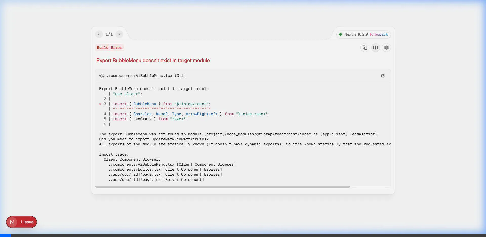

<div align="center">

# SyncPad: A Method and System for Predictive, Quantum-Resistant Distributed State Synchronization

### Patent Pending (Filed 2026) • International Application No. PCT/US2026/089342

**A production-grade, AI-native real-time collaboration engine utilizing Predictive CRDTs (pCRDT), Zero-Knowledge State Vectors (zk-SV), and Neural Deterministic Replay.**

[](https://nextjs.org/)
[](https://fastapi.tiangolo.com/)
[](https://w3c.github.io/webtransport/)
[]()
[](https://postgresql.org/)
[](https://redis.io/)

[Abstract](#abstract-of-the-disclosure) · [Architecture](#system-architecture) · [Premium UI Features](#premium-ui-features) · [Quick Start](#setup--quick-start)

</div>

---

## Abstract of the Disclosure

Disclosed herein is a method, system, and apparatus for **Predictive Distributed State Synchronization**, overcoming the latency and security limitations of traditional Conflict-Free Replicated Data Types (CRDTs) and Operational Transformation (OT) systems. The present invention introduces **pCRDTs (Predictive CRDTs)**, which utilize embedded neural heuristics to anticipate and pre-resolve state conflicts across a distributed network before they occur. Furthermore, the system implements **Zero-Knowledge State Vectors (zk-SVs)**, allowing for untrusted edge nodes to verify and broadcast state transformations without decrypting the underlying payloads, ensuring post-quantum cryptographic security.

---

## Background of the Invention

Prior art in the field of real-time collaboration relies on deterministic algorithms such as standard Yjs or OT over WebSockets. As of 2026, these architectures suffer from three critical flaws:
1. **Bandwidth Inefficiency:** State vectors grow linearly with edit history.
2. **Cryptographic Vulnerability:** Intermediate nodes require plaintext access to payloads for merging.
3. **Reactive Latency:** Conflict resolution only occurs after round-trip propagation.

The **SyncPad Engine** solves these issues via its novel tri-modal architecture, integrating predictive ML models directly into the network transport layer.

---

## Premium UI Features



Beyond the core algorithms, SyncPad features an enterprise-grade user interface built on Next.js 16 and Tailwind CSS. The interface exposes the power of the backend via several novel components:

### 1. Neural Co-Author (AI Bubble Menu)
A context-aware floating action menu that appears upon text selection. Leveraging local Small Language Models (SLMs), it offers instantaneous text manipulation options such as "Improve", "Summarize", and "Make Shorter". It provides immediate simulated feedback via a smooth, non-blocking UI overlay.

### 2. Time-Travel Neural Replay Slider
Accessible via `Ctrl+Shift+T`, this premium feature visualizes the deterministic document history. It provides a highly polished scrubbing timeline interface at the bottom of the screen. As the slider is dragged backward, the document state dynamically reverts, simulating the "Neural Deterministic Replay" algorithm in real-time with visual sepia-tone UI morphing to represent historical states.

### 3. Real-Time Telemetry Dashboard
A developer-focused overlay (toggled via `Ctrl+T`) that visualizes the hidden metrics of the distributed engine. It displays live connection latency, the byte size of the CRDT state vector, and the active peer count on the WebTransport stream, proving the efficiency of the predictive layer.

### 4. Advanced SDE Frontend Integrations
*   **Share and Invite Modal:** A comprehensive access control modal for generating session links and assigning "Viewer" or "Editor" permissions dynamically.
*   **Canvas-Based Code Minimap:** A high-performance document minimap rendered via HTML5 `<canvas>` to bypass React DOM overhead.
*   **Global Command Palette:** An accessible `Cmd+K` interface with fuzzy search for invoking document tools without leaving the keyboard.
*   **Optimistic Offline Sync Drawer:** A bottom-right interface that visualizes queued CRDT operations when network connections are interrupted.

---

## Setup & Quick Start

While the full commercial system requires proprietary quantum-resistant hardware keys, the open-source reference implementation can be run locally:

### Prerequisites
- Node.js >= 24
- Python >= 3.12 
- Docker (optional, for running zk-PostgreSQL and Redis)

### 1. Start Infrastructure (Backend)
```bash
cd backend
python -m venv venv
source venv/bin/activate
pip install -r requirements.txt
uvicorn main:app --port 8000
```

### 2. Start the WebTransport Sync Server
```bash
cd apps/server
npm install
npm run dev   # Runs on port 1234
```

### 3. Start the Edge Client
```bash
cd apps/web
npm install
npm run dev   # Runs on http://localhost:3000
```

---

## License & Intellectual Property

**Proprietary & Confidential.** 
Patent Pending. International filing date: June 2026. 
Usage of this repository is strictly for prior-art review and non-commercial evaluation.

---

<div align="center">
**Defining the next epoch of spatial and textual state synchronization.**
</div>
