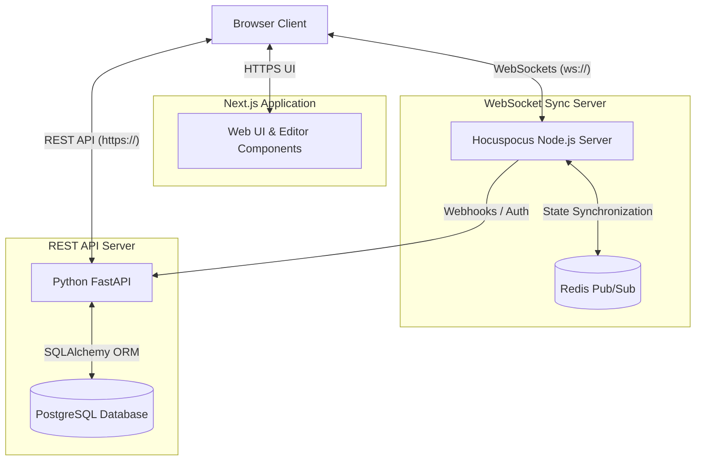
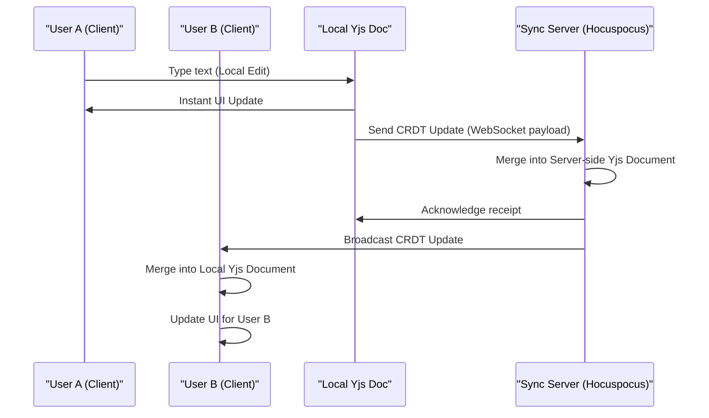
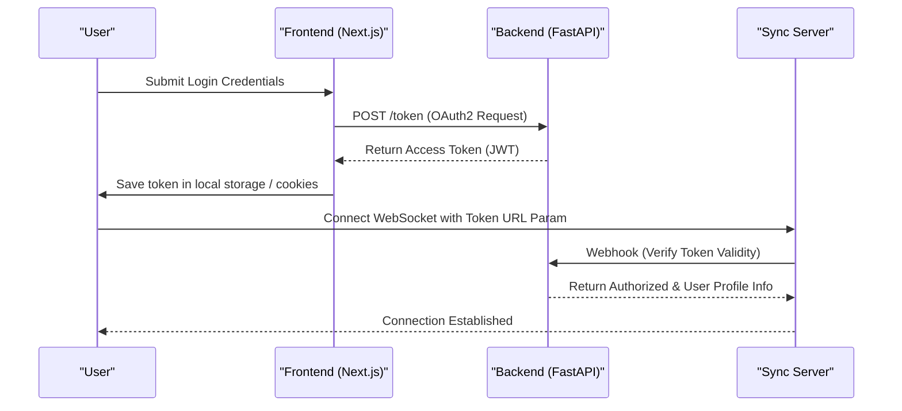
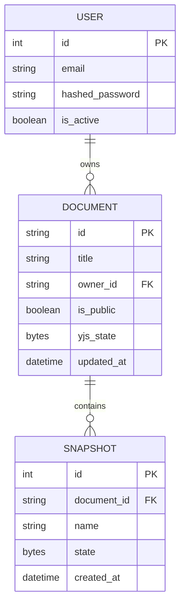

<div align="center">

# SyncPad

**A robust, real-time collaborative document editor built with Next.js, FastAPI, and Yjs CRDTs.**

[](https://nextjs.org/)
[](https://fastapi.tiangolo.com/)
[](https://yjs.dev/)
[](https://tiptap.dev/hocuspocus)
[](https://postgresql.org/)
[](https://redis.io/)

</div>

---

## Overview

SyncPad is a full-stack web application that allows multiple users to edit documents simultaneously in real-time. It leverages Conflict-Free Replicated Data Types (CRDTs) to ensure that document state remains consistent across all clients without requiring operational locking.

The application is split into three main layers:
1.  **Frontend (Next.js):** The user interface and text editor powered by Tiptap.
2.  **Sync Server (Hocuspocus/Node.js):** A WebSocket server that multiplexes Yjs CRDT document updates between connected clients.
3.  **Backend API (FastAPI):** A Python REST API handling user authentication, document persistence, and application logic.

---

## System Architecture

The following diagram illustrates the high-level architecture and how the three independent services interact with clients and databases.



💡 **How it works (in simple terms):** Think of this as a restaurant. The **Frontend (Next.js)** is the dining area where users interact. The **Backend (FastAPI)** is the main kitchen that handles secure, slow-moving logic like user accounts and saving data to the database. The **Sync Server (Hocuspocus)** is the high-speed conveyor belt (WebSockets) that instantly passes live text edits back and forth between everyone's tables without making them wait for the main kitchen.

---

## Real-Time Collaboration Flow

When users collaborate on a document, their keystrokes are merged locally into a Yjs document and then transmitted to the Sync Server. The server broadcasts the changes to all other connected peers.



💡 **How it works (in simple terms):** When two people edit the same document, they never have to "wait in line". If User A types a word, it shows up on their screen instantly. In the background, that word is packed into a tiny, mathematical message (a CRDT update) and sent to the Sync Server. The server acts like a traffic cop, broadcasting User A's word to User B's computer, where the algorithm seamlessly merges it into User B's screen without deleting what User B is currently typing.

---

## Authentication Flow

SyncPad uses secure JWT (JSON Web Token) authentication for the REST API, and integrates that token into the WebSocket connection handshake to ensure secure collaboration.



💡 **How it works (in simple terms):** To keep your documents completely private, we use a digital bouncer (JWT Authentication). When you log in, the Backend verifies your password and gives your browser a secure "VIP wristband" (a token). Later, when your browser tries to connect to the live-editing Sync Server, the server checks that wristband with the Backend before opening the WebSocket doors.

---

## Data Persistence & Entity Models

Document metadata and user profiles are stored in a relational PostgreSQL database using SQLAlchemy. The actual CRDT state vectors are stored as binary blobs.



💡 **How it works (in simple terms):** This is how we organize the digital filing cabinet in our PostgreSQL database. A **User** can own multiple **Documents**. Every Document stores the live, collaborative text as binary data (`yjs_state`). To enable our "Time-Travel" feature, a Document can also have multiple **Snapshots**, which are frozen, historical copies of the text from specific points in time.

---

## Key Features

*   **Real-time Synchronization:** Peer-to-peer style document editing via WebSockets.
*   **Offline Support:** Yjs CRDTs natively support offline edits that merge perfectly upon reconnection.
*   **Version History:** Save document states as snapshots and restore them at any time.
*   **Share & Permissions:** Secure links to invite collaborators.
*   **Telemetry Dashboard:** Monitor active peers and connection latency.
*   **AI Co-Author:** Highlight text to seamlessly improve, summarize, or rewrite using backend AI endpoints.

---

## Quick Start

### 1. Start Infrastructure (Docker)
Ensure you have Docker and Docker Compose installed.
```bash
docker-compose up -d
```
*This starts PostgreSQL and Redis.*

### 2. Start the Backend API (FastAPI)
```bash
cd backend
python -m venv venv
source venv/bin/activate
pip install -r requirements.txt
uvicorn main:app --port 8000 --reload
```

### 3. Start the Sync Server (WebSockets)
```bash
cd apps/server
npm install
npm run dev
```

### 4. Start the Frontend (Next.js)
```bash
cd apps/web
npm install
npm run dev
```
*Access the application at `http://localhost:3000`.*
